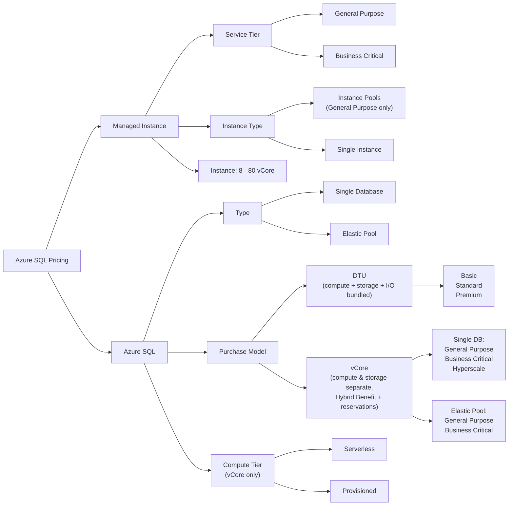

# Azure SQL

- Azure SQL is a family of Azure services based on the Microsoft SQL Server database engine
- The services share familiar SQL Server tools and the T-SQL language, but differ in compatibility and how much infrastructure Microsoft manages
- Azure SQL provides built-in patching, backups, high availability, monitoring, and security capabilities

## Azure SQL Service Map

- **Azure SQL Database**: fully managed platform as a service (PaaS) for modern cloud applications
    - Deploy as a single database or place multiple databases in an elastic pool
    - Best when applications can work at database scope and do not require full SQL Server instance compatibility
- **Azure SQL Managed Instance**: fully managed PaaS with near-full SQL Server instance compatibility
    - Best for migrations that require instance-scoped features with minimal application changes
- **SQL Server on Azure Virtual Machines**: infrastructure as a service (IaaS) with full SQL Server and operating system control
    - Best when the workload requires OS access, unsupported SQL Server features, or a specific SQL Server version
- **Elastic pool is not a separate service**: it is a purchasing and resource-sharing option for multiple Azure SQL databases

## Azure SQL Database

- A fully managed database service where Microsoft manages the database engine, operating system, patching, backups, and built-in availability
- Databases are associated with a **logical server**, which is an administrative container for logins, firewall rules, auditing, and policies; it is not a physical SQL Server
- Supports most database-scoped SQL Server features, but not every instance-scoped feature
- Choose Azure SQL Database for new cloud applications, isolated databases, and applications designed to scale at database level
- Deployment options:
    - **Single database**: one database receives its own purchased compute resources
    - **Elastic pool**: multiple databases share a purchased pool of compute resources

## Azure SQL Database - Elastic Pools

- An elastic pool contains multiple Azure SQL databases on the same logical server that share DTU-based or vCore-based compute resources
- Choose an elastic pool when databases have variable and unpredictable usage peaks that occur at different times
- The pool sets total resources, while optional per-database minimums and maximums prevent one database from consuming the entire pool
- Cost-effective for software as a service (SaaS) and multitenant designs with many databases that have low average utilization
- Avoid an elastic pool when each database has consistently high or predictable utilization; dedicated single-database resources can be easier to size
- Databases can be moved into and out of a pool

## Azure SQL Managed Instance

- A fully managed SQL instance with near-full compatibility with the SQL Server database engine
- Supports instance-scoped features such as SQL Server Agent, cross-database queries, CLR, Service Broker, and linked servers
- Deployed into a dedicated subnet in an Azure virtual network and accessed through private IP addresses by default
- Choose Managed Instance for lift-and-shift migrations that need instance-level features but do not require operating system access
- Uses the vCore purchasing model and supports General Purpose and Business Critical service tiers
- Does not support the DTU purchasing model or serverless compute
- Uses failover groups for cross-region disaster recovery; active geo-replication is an Azure SQL Database feature
- Choose SQL Server on Azure VMs instead when the workload requires OS access, file-system access, or unsupported SQL Server features

## Azure SQL Pricing

- Managed Instance:
    - Service tier:
        - General Purpose
        - Business Critical
    - Instance Type:
        - Instance Pools (available for General Purpose only)
        - Single Instance
    - Instance (vCore): 8 - 80
- Azure SQL
    - Type:
        - Single Database
        - Elastic Pool
    - Purchase Model:
        - DTU -> bundles compute, storage and I/O into a single unit (simple, fixed)
        - vCore -> independently choose compute and storage; supports Azure Hybrid Benefit and reservations
    - Services Tiers:
        - Single Database:
            - DTU:
                - Basic
                - Standard
                - Premium
            - vCores:
                - General Purpose
                - Business Critical
                - Hyperscale
        - Elastic Pool:
            - DTU:
                - Basic
                - Standard
                - Premium
            - vCores:
                - General Purpose
                - Business Critical
    - Compute Tier - for vCore models only:
        - Serverless
        - Provisioned
    - Instance Size - number of vCores/DTUs

## DTU vs vCore Purchasing Model

- The purchasing model determines how Azure SQL compute resources are selected and billed; it does not change the SQL language or application compatibility
- **DTU (Database Transaction Unit)** bundles CPU, memory, data I/O, and transaction log I/O into one performance unit
    - Choose DTU for small or straightforward Azure SQL Database workloads when simple bundled sizing is more important than resource transparency
    - Useful when existing DTU monitoring or benchmarks already provide a known size
    - Available only for Azure SQL Database single databases and elastic pools
    - Uses the Basic, Standard, and Premium service tiers
- **vCore** exposes the number of virtual cores and lets compute generation, service tier, storage, and compute tier be selected more independently
    - Choose vCore for most new production workloads because sizing and costs are easier to compare with on-premises hardware
    - Choose vCore when Azure Hybrid Benefit, reserved capacity, serverless compute, or independently configurable storage is required
    - Required for Azure SQL Managed Instance and Hyperscale
    - Uses the General Purpose, Business Critical, and Hyperscale service tiers
- For migrations, use the Azure SQL migration tools or the DTU calculator to estimate the required size from CPU, memory, I/O, and storage measurements
- A database can generally be converted between compatible DTU and vCore tiers, so the initial choice does not permanently lock the database to one model
- Exam rule of thumb:
    - **Simplicity and a small predictable workload** -> DTU
    - **Cost transparency, flexibility, production optimization, or SQL Server license benefits** -> vCore
    - **Managed Instance, Hyperscale, or serverless** -> vCore is required

## Service Tiers (vCore)

### General Purpose

- Balanced compute and storage; budget-oriented (default choice)
- Available for all deployment options: Single Database, Elastic Pool and Managed Instance
- Storage: remote (Azure Premium) -> higher latency
- Storage limit: up to 4 TB (Single DB / Elastic Pool), up to 16 TB (Managed Instance)
- Availability based on separation of compute and storage (single replica)
- Supports zone-redundant configuration and serverless compute
- SLA: 99.99%

### Business Critical

- High performance, low latency local SSD storage
- Available for all deployment options: Single Database, Elastic Pool and Managed Instance
- Uses Always On availability group with 3 replicas
- Includes a free built-in read-only replica (read scale-out)
- In-Memory OLTP support
- Storage limit: up to 4 TB
- Highest resilience; supports zone-redundancy
- Higher cost than General Purpose
- SLA: 99.99% (up to 99.995% with zone redundancy)

### Hyperscale

- Highly scalable storage up to 100 TB
- Decoupled compute, log and storage architecture
- Fast (near-instant) backups and restores regardless of DB size, based on snapshots
- Rapid horizontal read scale-out -> up to 4 high-availability secondary replicas
- Best for very large databases that need fast scaling
- Single Database only -> not available for Managed Instance or Elastic Pool
- Supports serverless compute

> Note: DTU model has its own tiers -> Basic, Standard, Premium (Single DB and Elastic Pool only).

## Service Tiers (DTU)

- Available for Single Database and Elastic Pool only (not Managed Instance)
- Bundles compute, storage and I/O into a single DTU unit

### Basic

- Lowest cost; for small, infrequently used databases
- Limited storage and performance
- SLA: 99.99%

### Standard

- General-purpose workloads with balanced price/performance
- Wider range of storage and DTU sizes
- SLA: 99.99%

### Premium

- High performance for I/O-intensive, mission-critical workloads
- Uses local SSD storage with built-in replicas (Always On)
- Supports In-Memory OLTP and read scale-out
- SLA: 99.99%

## Failover Options

- Failover protects against three different failure scopes: node/instance failure, **zone** outage, and **region** outage
- Choose the option by the failure you must survive, then by the required **RPO** (data loss) and **RTO** (downtime)

### Local High Availability (in-region, automatic)

- Built into every tier - no configuration and no extra cost, handled by the service fabric
- **General Purpose / Standard / Basic**: single compute replica with remote storage; on failure a new compute node attaches to the same storage
    - No data loss (RPO = 0), but failover takes longer because the node must be re-provisioned
- **Business Critical / Premium**: Always On availability group with 3 synchronous replicas on local SSD
    - **RPO = 0** (no data loss) and the fastest failover, because a secondary is already online
- **Hyperscale**: compute is decoupled from page servers and the log service; add **high-availability secondary replicas** (up to 4) to speed up failover
    - Without HA secondaries, failover requires a new primary compute node to warm up

### Zone Redundancy (survives an availability zone outage)

- Opt-in setting that spreads replicas across **availability zones** in the same region; must be enabled at creation or configured later where supported
- Supported by General Purpose, Business Critical / Premium, and Hyperscale (Hyperscale requires HA secondary replicas)
- Not available in every region, and requires the region to have availability zones
- Failover is automatic and transparent to the application - the connection string does not change
- Raises the SLA to **99.995%** for Business Critical / Premium zone-redundant configurations
- Cheapest option that gives **zero data loss + zone resilience** -> Business Critical / Premium with zone redundancy

### Active Geo-Replication (cross-region, Azure SQL Database only)

- Creates up to **4 readable secondary databases** in the same or different regions
- Replication is **asynchronous** -> small potential data loss; **RPO ≈ 5 seconds**, **RTO ≈ 30 seconds**
- Failover is **manual** (initiated by the application or an administrator)
- Secondaries are readable, so they can also offload read-only reporting workloads
- Each secondary has its own connection endpoint -> the application must handle the endpoint change
- Not supported for Azure SQL Managed Instance

### Auto-Failover Groups (cross-region, automatic)

- Groups one or more databases (or an entire Managed Instance) and replicates them to a secondary region
- Provides **listener endpoints** that stay the same after failover:
    - Read-write listener -> always points to the current primary
    - Read-only listener -> points to the secondary for read workloads
- Supports **automatic failover** driven by a configurable **grace period** (default 1 hour) or manual failover
- Uses asynchronous replication -> **RPO ≈ 5 seconds**, **RTO ≈ 1 hour** with automatic failover policy
- The only cross-region business-continuity option for **Managed Instance**
- Preferred over active geo-replication when the application must fail over without a connection string change

### Geo-Restore (cross-region, from backups)

- Restores a database in any region from geo-redundant backups (**GRS/GZRS**)
- Cheapest disaster recovery option - included with backups, no secondary database to pay for
- Slowest recovery: **RPO up to 1 hour**, **RTO up to 12 hours**
- Use when the recovery objectives are relaxed and cost is the primary driver

### Exam Rules of Thumb

- **No data loss required (RPO = 0)** -> synchronous replicas -> Business Critical / Premium (or zone redundancy)
- **Survive a zone outage at the lowest cost** -> zone-redundant Premium / Business Critical
- **Survive a region outage with the same connection string** -> auto-failover group
- **Survive a region outage with readable secondaries and manual control** -> active geo-replication
- **Managed Instance cross-region DR** -> failover group (active geo-replication is not available)
- **Cheapest possible DR, relaxed RTO** -> geo-restore from geo-redundant backups

## Backup Options

- Backups are **automatic** in Azure SQL Database and Managed Instance; there is nothing to schedule
- Backup cadence (all tiers except Hyperscale):
    - **Full** backup weekly
    - **Differential** backup every 12-24 hours
    - **Transaction log** backup every 5-10 minutes
- **Point-in-Time Restore (PITR)** - short-term retention:
    - Configurable **1-35 days**, default **7 days**
    - Basic tier (DTU) supports only **1-7 days**
    - Restore always creates a **new database**; it does not overwrite the existing one
- **Long-Term Retention (LTR)**:
    - Keeps weekly, monthly and yearly full backups for **up to 10 years**
    - Used for compliance and audit requirements
    - Available for Azure SQL Database (including Hyperscale) and Managed Instance
- **Backup storage redundancy** (chosen at database creation):
    - **LRS** - cheapest, single datacenter
    - **ZRS** - across availability zones in the region
    - **GRS** - default; paired region copy, enables **geo-restore**
    - **GZRS** - zone + geo redundancy
    - Geo-restore from geo-redundant backups: RPO up to 1 hour, RTO up to 12 hours
- **Cost**: backup storage equal to 100% of the maximum data size is included; extra storage and LTR are billed separately

### Backups by Service Tier

- **General Purpose / Standard / Basic**: standard full + differential + log backups; PITR and LTR supported
- **Business Critical / Premium**: same backup model as General Purpose; the extra replicas provide availability, **not** backup
- **Hyperscale**:
    - Uses **snapshot-based** backups on Azure storage - no traditional full/differential/log backups
    - Backup and restore are **near-instantaneous** regardless of database size (constant time)
    - PITR retention **1-35 days**; LTR is supported
    - Backup storage redundancy can only be set at creation and **cannot be changed** afterwards
- **Managed Instance**:
    - Same automated backup model as Azure SQL Database, PITR **1-35 days** and LTR up to 10 years
    - Additionally supports **COPY_ONLY** native backups to Azure Blob Storage and restore from `.bak` files (URL-based restore)
- **SQL Server on Azure VMs**: backups are **not** automatic - use Azure Backup for SQL Server VMs or native SQL Server backup to URL

## Columnstore Indexing

- Stores data **column by column** instead of row by row, which suits analytical queries that scan many rows but few columns
- Optimized for **OLAP / data warehousing and reporting** workloads; rowstore (B-tree) indexes remain the choice for **OLTP** point lookups and short transactions
- Key benefits:
    - Up to **10x query performance** gain over rowstore for analytical scans and aggregations
    - Up to **10x data compression** over uncompressed rowstore, reducing storage cost and I/O
    - Batch mode execution processes rows in batches instead of one at a time
- Index types:
    - **Clustered columnstore index (CCI)**: the entire table is stored in columnar format; highest compression, best for large fact tables
    - **Nonclustered columnstore index (NCCI)**: a columnar copy of selected columns on a rowstore table; enables **real-time operational analytics** (analytics on an OLTP table without a separate warehouse)
- Availability:
    - Supported in Azure SQL Database, Azure SQL Managed Instance, and SQL Server on Azure VMs
    - Requires **Standard tier S3 or higher** (DTU model); not available in Basic or Standard S0-S2
    - Available in all vCore tiers (General Purpose, Business Critical, Hyperscale)
    - Enabled by default for new tables in Azure Synapse Analytics dedicated SQL pools
- Considerations:
    - Best for tables with **at least ~1 million rows** per partition; small tables see little benefit
    - Frequent single-row updates/deletes degrade columnstore efficiency; use index reorganize/rebuild to maintain it
    - Can be combined with a rowstore index on the same table for hybrid (HTAP) workloads

## Which Azure SQL to Choose?

### Deployment Option

- Are we migrating an on-prem SQL with instance-level features? -> Managed Instance
- Do we need multiple low-utilization DBs? -> Elastic Pool
- Do we need very large databases (>4 TB) with fast scaling? -> Hyperscale
- Do we need OS access, a specific SQL Server version, or unsupported features? -> SQL Server on Azure VMs
- All other cases -> Azure SQL Database

### Which Service Tier (vCore)

- **General Purpose** - default, balanced price/performance; remote storage, single replica
    - Line-of-business web app backend with moderate, predictable traffic
    - Dev/test and internal apps where a few milliseconds of extra storage latency is acceptable
    - Departmental app under 4 TB that needs 99.99% SLA at the lowest vCore cost
    - Managed Instance migration where the source workload is not latency-sensitive
- **Business Critical** - low-latency local SSD, 3 replicas, free read-only replica, In-Memory OLTP
    - High-volume OLTP such as order processing, payments, or trading with strict latency requirements
    - Mission-critical app that needs the highest SLA (99.995% with zone redundancy)
    - Reporting queries must be offloaded to the built-in read replica without extra cost
    - Workload uses memory-optimized tables (In-Memory OLTP)
- **Hyperscale** - decoupled storage up to 100 TB, snapshot backups, up to 4 read replicas
    - Database is growing beyond 4 TB or growth is unpredictable (IoT telemetry, logs, historical archive)
    - Multi-TB database must be backed up or restored in minutes instead of hours
    - Read-heavy workload needs to scale out to several secondary replicas
    - Note: Single Database only - not available for Managed Instance or Elastic Pool

### Which Service Tier (DTU)

- **Basic** - lowest cost, small storage, low throughput
    - Small internal tool, prototype, or rarely used database
    - Dev/test database where cost matters more than performance
    - Note: PITR retention limited to 1-7 days
- **Standard** - balanced price/performance for typical workloads
    - Departmental or small SaaS app with normal transactional traffic
    - Web app backend that does not need low-latency local SSD storage
    - Note: columnstore indexing requires S3 or higher
- **Premium** - local SSD, built-in replicas, In-Memory OLTP, read scale-out
    - I/O-intensive, mission-critical OLTP workload that must stay on the DTU model
    - Equivalent of Business Critical when the organization already standardized on DTU sizing

### Which Compute Tier (vCore)

- **Provisioned** - fixed compute always allocated
    - Steady, predictable usage such as a production app used during business hours every day
- **Serverless** - auto-scales and auto-pauses, billed per second of compute used
    - Intermittent or unpredictable usage: dev/test, demo, seasonal, or rarely queried databases
    - Note: not available for Managed Instance or Business Critical

### Which Purchasing Model

- **DTU** - simple bundled sizing for small, predictable Azure SQL Database workloads
- **vCore** - most new production workloads; required for Managed Instance, Hyperscale, and serverless, and needed for Azure Hybrid Benefit and reserved capacity