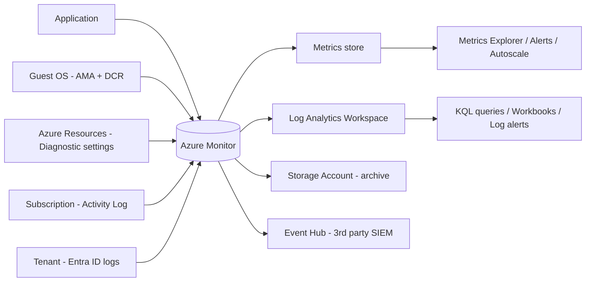

# Azure Monitor

- It is a central location for all the monitoring aspects of Azure's resources
- Provides access to metrics, logs, insights and more
- Has additional capabilities not found in the individual resources

## What Azure Monitor Collects

- **Metrics**: numerical, time-series values; lightweight and near real-time; good for alerting and dashboards
- **Logs**: timestamped event/trace/performance records; stored in a Log Analytics Workspace; queried with KQL
- Data sources span the full stack:
    - **Application**: Application Insights (requests, dependencies, exceptions)
    - **Guest OS**: metrics and logs from inside VMs (via Azure Monitor Agent)
    - **Azure resource**: platform metrics and resource (diagnostic) logs
    - **Azure subscription**: Activity Log (control-plane operations, service health)
    - **Azure tenant**: Microsoft Entra ID logs (sign-ins, audit)
    - **Custom sources**: via Data Collection / ingestion APIs

## Core Building Blocks

- **Metrics database**: platform metrics auto-collected; retained ~93 days
- **Log Analytics Workspace**: central store for logs; queried with KQL; configurable retention/archive
- **Diagnostic settings**: route platform logs/metrics to Log Analytics, Storage, or Event Hub
- **Data Collection Rules (DCR)**: define what the Azure Monitor Agent collects and where it goes
- **Activity Log**: subscription-level audit of resource operations

## Capabilities Beyond Individual Resources

- **Cross-resource correlation**: query and alert across many resources from one place
- **Alerts & Action Groups**: metric, log, and activity log alerts with reusable notification/action groups
- **Insights**: curated experiences (Application Insights, VM Insights, Container Insights, Network Insights)
- **Visualization**: Workbooks, dashboards, and integration with Grafana / Power BI
- **Autoscale**: scale resources (e.g. VM Scale Sets, App Service) based on metric thresholds or schedules
- **Application Insights**: full APM - distributed tracing, live metrics, availability tests, dependency maps

## Data Flow

## Application Insights

- APM service; part of Azure Monitor, stores data in a Log Analytics Workspace (workspace-based, classic is retired)
- **Instrumentation**:
    - **Auto-instrumentation (codeless)**: App Service, Functions, AKS, VMs - no code change
    - **SDK**: manual instrumentation for custom telemetry
    - **OpenTelemetry**: the recommended, vendor-neutral approach going forward
- **Telemetry types**: requests, dependencies, exceptions, traces, custom events/metrics, page views
- **Features**:
    - **Live Metrics**: near real-time stream with ~1s latency
    - **Application Map**: visual dependency topology across components
    - **Transaction search / end-to-end distributed tracing** (correlated by operation ID)
    - **Availability tests**: ping/URL and multi-step tests from global points of presence
    - **Smart Detection**: automatic anomaly detection (failure spikes, performance degradation)
    - **Usage analytics**: funnels, cohorts, user flows, retention
- **Sampling**: adaptive/fixed-rate sampling reduces ingestion volume and cost while preserving statistical accuracy

## Service Health & Resource Health

- **Azure Status**: global view of Azure service outages (public page)
- **Service Health**: personalized view - service issues, planned maintenance, health advisories affecting *your* subscriptions and regions
- **Resource Health**: health of a specific resource instance (Available / Unavailable / Degraded / Unknown)
- Create **Activity Log alerts** on Service Health and Resource Health events to get notified proactively

## Pricing Model

- Billing is mostly **consumption based** on data ingested and retained:
    - **Log ingestion** per GB (Analytics vs Basic vs Auxiliary table plans)
    - **Retention** beyond the free period (31 days, 90 days when Sentinel/App Insights is enabled) per GB/month
    - **Archive** tier is much cheaper, but requires search jobs / restore to query
    - **Commitment tiers** (100 GB/day and up) give significant discounts over pay-as-you-go
- **Platform metrics and Activity Log are free**; exporting them to a workspace is billed
- Alerts billed per alert rule / metric time-series; Application Insights billed on ingested telemetry
- Cost control levers: sampling, filtering with DCR transformations, correct table plan, shorter retention + archive

## Design & Exam Considerations

- **Metrics vs Logs**: use metrics for fast, cheap, numeric alerting/autoscale; use logs for rich, correlated, historical analysis
- **Retention**: platform metrics 93 days -> need longer? send to Log Analytics or Storage via diagnostic settings
- **Workspace placement**: same region as monitored resources to avoid egress cost and latency; keep in mind data sovereignty
- **Centralized vs decentralized workspaces**: one workspace simplifies correlation and commitment-tier discounts; multiple workspaces help with RBAC isolation, data residency, and chargeback
- **Access control**: workspace-context vs resource-context RBAC; use resource-context so users only see logs for resources they can access
- **Scale**: use Azure Policy to enforce diagnostic settings and agent deployment across subscriptions
- **Streaming out**: Event Hub is the destination for third-party SIEM/analytics tools (Splunk, Datadog, QRadar)

## Azure Monitor vs Microsoft Sentinel

- **Azure Monitor**: operational monitoring, performance, and health of resources
- **Microsoft Sentinel**: cloud-native SIEM/SOAR built on top of Log Analytics; focused on security threat detection and response
- **Microsoft Defender for Cloud**: security posture management and workload protection; also stores data in Log Analytics
- They share the same Log Analytics Workspace, so a single ingestion pipeline can serve ops and security use cases